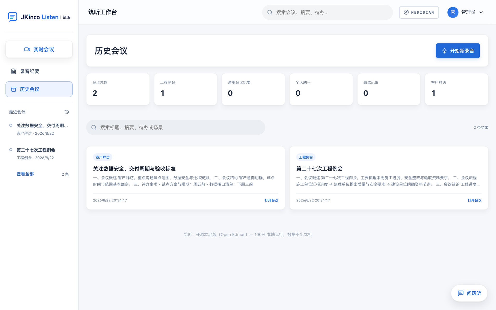
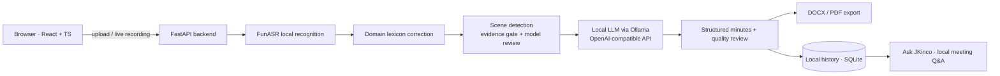

<div align="center">


# JKinco Listen (Open Edition)

**A local-first AI workbench that turns meeting recordings into finished minutes.**

Recording → transcript → scene detection → structured minutes → DOCX/PDF, running **entirely on your own machine**.
No API keys. No cloud calls. Your audio never leaves your computer.

[简体中文](README.zh-CN.md) · [Docs site](https://wenxuanzhang1209-cyber.github.io/jkinco-listen-open/) · [Architecture](docs/ARCHITECTURE.en.md) · [Model guide](docs/LOCAL_MODELS.en.md) · [Roadmap](docs/ROADMAP.en.md)

[](https://github.com/wenxuanzhang1209-cyber/jkinco-listen-open/actions/workflows/ci.yml)


[](CONTRIBUTING.md)

</div>

---

## Why this exists

Almost every meeting-notes product sends your audio to someone else's servers: upload the
recording, pay per minute, trust a third party with the contents.

For a construction site review, a customer visit, or a job interview, that trade is often
unacceptable — so people fall back to typing up notes by hand.

JKinco Listen moves the whole pipeline onto your machine:

- **Local speech recognition** — Chinese meeting-grade ASR with voice-activity detection,
  punctuation restoration, and domain-term correction.
- **Local LLM** — scene detection, minutes generation, quality review, and meeting Q&A all
  run against a model you host (Ollama, or any OpenAI-compatible endpoint).
- **Local template engine** — five meeting types exported to DOCX/PDF with the original
  corporate layout preserved.
- **Local history** — meetings, transcripts, minutes, and human edits stay in a SQLite file
  you own.

> One command to deploy. Audio in, minutes out. Nothing leaves the building.

## How it compares

|  | JKinco Listen (Open) | Cloud note-takers | Raw Whisper / FunASR |
|---|---|---|---|
| Audio leaves your machine | **Never** | Yes | Never |
| API key / subscription | **None** | Required | None |
| Works fully offline | **Yes**, after first model download | No | Yes |
| Output | **Formatted DOCX/PDF minutes** | Transcript + summary | Raw transcript |
| Domain accuracy | **Hotword lexicon + post-correction** | Generic | Generic |
| Meeting-type awareness | **5 scenes, evidence-gated** | One format | None |
| Self-hosted, MIT licensed | **Yes** | No | Library only |

If you only need a transcript, use Whisper directly — it is simpler. This project exists for
the part *after* the transcript: turning it into a document somebody can actually file.

## Highlights

| | |
|---|---|
| **Two local model stacks** | FunASR `paraformer-zh` for speech + any Ollama / OpenAI-compatible model for text |
| **Evidence-gated scene detection** | Rule-based gate first, model second — the model cannot force a construction template onto a meeting that lacks the evidence |
| **Original-layout export** | DOCX/PDF that match the real corporate templates, not a generic markdown dump |
| **Privacy by construction** | No API keys, no telemetry, no outbound model calls; CI fails the build if cloud-model traces appear in the repo |
| **One-command deploy** | `docker compose up` brings up web, backend, Ollama, and model pull |
| **895 automated tests** | Plus security headers, rate limiting, injection defenses, and an audit log |
| **Local knowledge base** | Search past meetings and ask questions across them, without anything leaving the machine |

## Screenshots


<sub>Full-resolution MP4: <a href="docs/demo.mp4">docs/demo.mp4</a></sub>

**This is what comes out** — summary, agenda flow, conclusions, and action items, with the
full recording-to-export pipeline on the right:


<details>
<summary>More screens (click to expand)</summary>

**Sign-in** — a local account, no cloud registration


**Workspace** — upload, live recording, or read straight from a recorder; seven scene tabs


**History** — per-scene stats, full-text search, reopen and export any past meeting



</details>

## Quick start (Docker)

Requires Docker. 16 GB RAM recommended; 8 GB works but is slower.

```bash
git clone https://github.com/wenxuanzhang1209-cyber/jkinco-listen-open.git
cd jkinco-listen-open
cp .env.example .env
docker compose up -d --build
```

Open <http://localhost:8080>.

> **Set a password before you expose this to a network.** `.env.example` ships with
> `JKINCO_AUTH=admin:123456` so that a local trial works immediately. The container listens on
> `0.0.0.0`, so anyone who can reach the port can sign in with those credentials. Change
> `JKINCO_AUTH` in `.env` before binding it to anything other than localhost.

The first start automatically:

1. downloads the local ASR model (~1–2 GB; fully offline afterwards);
2. pulls the local LLM `qwen2.5:7b-instruct` via Ollama;
3. builds the web UI and starts the backend.

Want a different model? `OLLAMA_MODEL=qwen2.5:14b docker compose up -d` — nothing else changes.

**NVIDIA GPU:**

```bash
docker compose -f docker-compose.yml -f docker-compose.gpu.yml up -d
```

Apple Silicon needs no configuration; Ollama uses Metal automatically.

**Try it before downloading any model:**

```bash
docker compose -f docker-compose.yml -f docker-compose.demo.yml up -d
```

Demo mode seeds two example minutes so the UI, exports, and history search are all usable
without a model.

## Manual setup

One command, for people who would rather not use Docker:

```bash
bash scripts/install.sh        # Ollama model + Python deps + frontend
bash scripts/start.sh
```

Or step by step:

```bash
# 1. Local LLM (pick one)
brew install ollama && ollama pull qwen2.5:7b-instruct   # macOS
curl -fsSL https://ollama.com/install.sh | sh             # Linux

# 2. Backend
python3 -m venv .venv && source .venv/bin/activate
pip install -r requirements.txt
cp .env.example .env

# 3. Frontend
cd frontend && npm ci && npm run build && cd ..

# 4. Run
uvicorn backend.main:app --host 0.0.0.0 --port 8080
```

Larger model: `OLLAMA_MODEL=qwen2.5:14b bash scripts/install.sh`

## Model guide

| Stage | Default | Alternatives | Notes |
|---|---|---|---|
| Speech recognition | FunASR `paraformer-zh` | `fsmn-vad` + `ct-punc` | Best value for Chinese meetings; runs on CPU |
| Scene review | Ollama `qwen2.5:7b-instruct` | `qwen2.5:14b`, `qwen3:8b` | The evidence gate has the final say, so a wrong model answer cannot flip the result |
| Minutes generation | Ollama `qwen2.5:7b-instruct` | Larger models | Chunk → extract in parallel → merge → quality review |
| Meeting Q&A | Same | Same | Local retrieval and generation; history stays on the machine |

Hardware and quantization guidance: [docs/LOCAL_MODELS.en.md](docs/LOCAL_MODELS.en.md).

## Architecture



Module boundaries, data flow, and the security perimeter: [docs/ARCHITECTURE.en.md](docs/ARCHITECTURE.en.md).

## Core capabilities

### Evidence-gated scene detection

Five meeting types are distinguished by the roles, business actions, and deliverables that
appear in the transcript:

- **Construction site review** — multiple accountable parties (contractor, supervisor,
  owner) plus a production-control agenda plus periodic review. The formal template is used
  only when that evidence chain is present.
- **General minutes** — management reports, business reviews, project weeklies. No fixed
  template; the model organizes the clearest structure for the source material.
- **Personal assistant** — personal notes, retrospectives, follow-ups.
- **Interview record** — candidate evaluation, competency assessment, hiring recommendation.
- **Customer visit** — customer needs, discussion points, ownership.

The rule-based gate runs first, and it wins: **the model cannot classify a meeting as a
construction review on the strength of generic words like "project", "schedule", "quality".**

### Long recordings

- Duration gate with decompression-bomb protection, measured by decoded duration rather than
  file size.
- Long transcripts are chunked and extracted in parallel; gaps are recorded rather than
  silently discarding the whole run.
- Job queue with per-user quotas and retries. A dropped connection does not lose work already
  transcribed.

### Export and delivery

- Six templates: construction, general, personal, interview, customer visit, and custom
  uploads.
- DOCX and PDF export preserving the original layout, with collision-proof filenames.
- Optional DingTalk bot delivery with request signing. Disabled unless configured.

## Privacy and security

- No cloud model calls, no API keys, no telemetry.
- Audio, transcripts, minutes, and human edits are stored only on the local machine.
- Login rate limiting, CAPTCHA, signed sessions, CSP and security headers, audit log.
- Template upload hardening: zip bombs, path traversal, and XML entity attacks.
- CI enforces the open-edition boundary: the build fails if cloud-model references or
  credentials appear in the repository.

## Testing

```bash
python -m pytest tests-v2 -q                 # 895 tests
python scripts/smoke_test.py                 # offline smoke: scene routing + every export
python scripts/check_open_source_hygiene.py  # open-edition boundary scan
```

GitHub Actions runs the boundary scan, the backend tests, and the frontend build on every
push.

## FAQ

**Do I need a GPU?**
No. The FunASR Chinese model and a quantized 7B model run on a 16 GB CPU machine — just
slower. An NVIDIA or Apple Silicon GPU speeds things up noticeably.

**What if the model download fails?**
Only the first download needs network access; everything afterwards is offline. Point
`JKINCO_ASR_MODEL_DIR` at an existing model directory to skip the download entirely.

**Can I look around before downloading models?**
Set `JKINCO_DEMO_DATA=1` and start. Two example minutes (a construction review and a customer
visit) appear in history, and export, search, and templates all work without any model.

**Is there live captioning?**
Experimental. Set `JKINCO_REALTIME_LOCAL_ASR=1` to run live captions through a local
`paraformer-zh-streaming` model (an extra download on first use). Off by default.

**Can I use it commercially?**
Yes, under the MIT License. Please keep the copyright notice.

**Does it work with languages other than Chinese?**
The ASR model and the domain lexicon are tuned for Chinese meetings. The architecture is
model-agnostic, so swapping in another FunASR or Whisper model is possible — multi-language
support is on the roadmap rather than finished.

## Roadmap

- [x] Upload → local transcription → scene detection → minutes → export
- [x] History knowledge base and local meeting Q&A
- [x] Streaming live captions (experimental: `JKINCO_REALTIME_LOCAL_ASR=1`)
- [ ] Speaker diarization and role attribution
- [ ] WebDAV / cloud-drive backup
- [ ] Desktop installers (macOS / Windows)
- [ ] Multi-language support (Cantonese / English / Japanese)

Full plan: [docs/ROADMAP.en.md](docs/ROADMAP.en.md).

## Contributing

Issues, pull requests, and localization help are all welcome. Please read
[CONTRIBUTING.md](CONTRIBUTING.md) first, and run the boundary scan and the test suite before
submitting.

## License

[MIT](LICENSE) © 2026 JKinco

---

## Support this project

If JKinco Listen saved you from typing up one more set of meeting minutes, please **Star** it ⭐.

[](https://star-history.com/#wenxuanzhang1209-cyber/jkinco-listen-open&Date)
