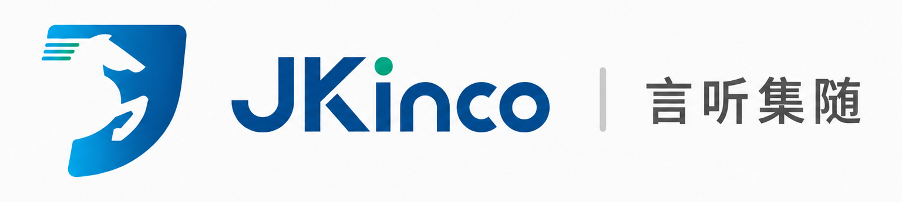
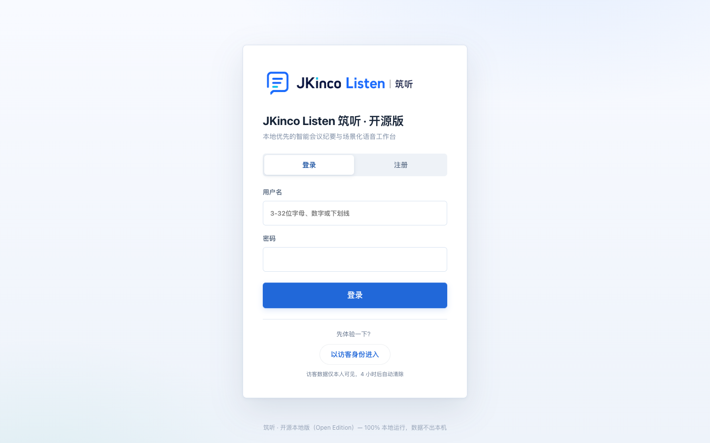
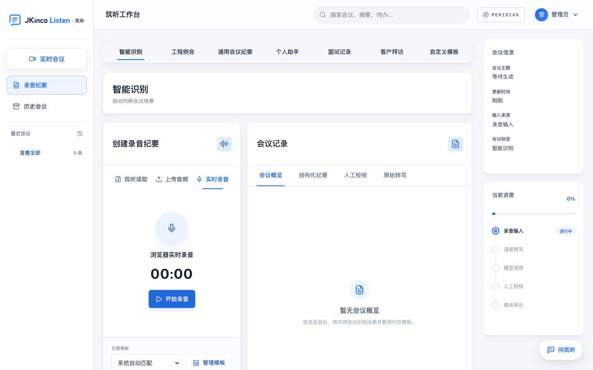
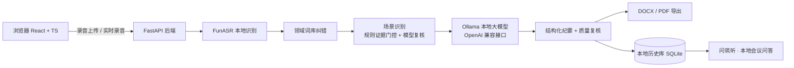

<div align="center">



# JKinco Listen · 筑听（开源本地版）

**Local-first AI Meeting Minutes Workbench**

录音转写 → 场景识别 → 结构化纪要 → DOCX/PDF 导出，全流程 **100% 本地运行**。
不需要任何 API Key，录音与纪要数据**永不离开你的电脑**。

[English](README.en.md) · [架构](docs/ARCHITECTURE.md) · [模型指南](docs/LOCAL_MODELS.md) · [路线图](docs/ROADMAP.md)


[](CONTRIBUTING.md)

</div>

---

## 为什么会有这个项目

会议录音转成纪要，市面上几乎都要走云端：录音上传、按分钟计费、数据过第三方。
对工程监理、客户拜访、面试记录这类**敏感场景**，很多人宁愿手动整理，也不敢上传。

筑听开源本地版把这些能力全部搬到本机：

- **本地语音识别**：中文会议级 ASR（VAD 静音检测 + 标点恢复 + 工程领域纠错）；
- **本地大模型**：场景识别、纪要生成、质量复核、会议问答全部走本地模型；
- **本地模板引擎**：工程例会 / 通用纪要 / 个人备忘 / 面试记录 / 客户拜访五类场景，
  DOCX/PDF 原版式导出；
- **本地历史库**：会议、转写、纪要、校核稿全部存在本机，随时检索与导出。

> 一句话：**一条命令部署，录音进，纪要出，数据不出门。**

## ✨ 亮点

| | 能力 |
|---|---|
| 🧠 **双本地模型栈** | FunASR `paraformer-zh` 中文识别 + Ollama 任意 OpenAI 兼容本地模型 |
| 🏗️ **工程场景识别** | 规则证据门控 + 模型复核，拒绝“看着像工程会就套工程模板” |
| 📄 **原版式导出** | 工程例会、面试记录、客户拜访等 DOCX/PDF，保留真实模板排版 |
| 🔐 **隐私第一** | 无 API Key、无云端调用、无遥测；模型下载完成后完全离线可用 |
| 🚀 **一键部署** | `docker compose up` 全家桶：Web + 后端 + Ollama + 模型拉取 |
| 🧪 **工程级质量** | 888 个自动化测试、安全头、限流、防注入、审计日志全覆盖 |
| 🗃️ **历史知识库** | 会议历史检索 + “问筑听”本地问答，跨会议追待办不丢上下文 |

## 🖥️ 界面预览





## 🚀 快速开始（推荐：Docker）

要求：已安装 Docker，机器建议 16GB 内存（8GB 可用但会更慢）。

```bash
git clone https://github.com/wenxuanzhang1209-cyber/jkinco-listen-open.git
cd jkinco-listen-open
cp .env.example .env
docker compose up -d --build
```

打开 <http://localhost:8080>，默认账号 `admin / 123456`。

首次启动会自动：

1. 下载本地 ASR 模型（约 1–2GB，之后完全离线）；
2. 拉取本地大模型 `qwen2.5:7b-instruct`（Ollama）；
3. 构建 Web 界面并启动后端。

> 想换模型？`OLLAMA_MODEL=qwen2.5:14b docker compose up -d` 即可，其余不变。

## 🛠️ 手动安装

```bash
# 1. 本地大模型（任选其一）
brew install ollama && ollama pull qwen2.5:7b-instruct   # macOS
curl -fsSL https://ollama.com/install.sh | sh             # Linux

# 2. 后端
python3 -m venv .venv && source .venv/bin/activate
pip install -r requirements.txt
cp .env.example .env

# 3. 前端
cd frontend && npm ci && npm run build && cd ..

# 4. 启动
uvicorn backend.main:app --host 0.0.0.0 --port 8080
```

## 🧠 模型指南

| 环节 | 默认模型 | 备选 | 说明 |
|---|---|---|---|
| 语音识别 | FunASR `paraformer-zh` | `fsmn-vad` + `ct-punc` | 中文会议最优性价比，CPU 可跑 |
| 场景复核 | Ollama `qwen2.5:7b-instruct` | `qwen2.5:14b`、`qwen3:8b` 等 | 证据门控兜底，模型说错也翻不了盘 |
| 纪要生成 | Ollama `qwen2.5:7b-instruct` | 更大模型 | 自动分块 → 并行提取 → 合成 → 质量复核 |
| 会议问答 | 同上 | 同上 | 本地检索 + 生成，历史不出本机 |

详细硬件与量化建议见 [docs/LOCAL_MODELS.md](docs/LOCAL_MODELS.md)。

## 🏗️ 架构



模块职责、数据流与安全边界见 [docs/ARCHITECTURE.md](docs/ARCHITECTURE.md)。

## 🗂️ 核心能力

### 智能场景识别

根据转写中的角色、业务动作与交付物证据，区分五类场景：

- **工程例会**：施工、监理、建设等多责任主体 + 生产控制议程 + 周期复盘，形成证据链才使用工程模板；
- **通用会议纪要**：管理汇报、经营分析、项目周会等，由模型按原文组织结构；
- **个人助手**：个人备忘、工作复盘、事项跟进；
- **面试记录**：候选人评价、能力评估、录用建议；
- **客户拜访**：客户诉求、沟通要点、责任分工。

规则证据门控优先：**模型不能仅凭“项目、进度、质量”这类泛词把会议套成工程例会**。

### 长录音处理

- 时长闸门 + 解压炸弹防护（按解码时长而非文件大小）；
- 超长转写自动分块，并行提取、缺失留痕、不整段作废；
- 任务队列、按用户配额、失败可重试，断网不丢已转写内容。

### 导出与推送

- 六套模板（工程/通用/个人/面试/客户拜访/自定义）；
- Word、PDF 原版式导出，文件名唯一防覆盖；
- 可选钉钉机器人推送（加签），不配置即关闭。

## 🔐 隐私与安全

- **无云端模型调用、无 API Key、无遥测**；
- 音频、转写、纪要、校核稿全部保存在本机；
- 登录限流、验证码、会话签名、CSP/安全头、审计日志；
- 模板上传解压防护（Zip 炸弹、路径穿越、XML 实体）；
- 开源版红线上限：CI 自动扫描，禁止任何云端模型痕迹与密钥混入仓库。

## 🧪 测试与质量

```bash
python -m pytest tests-v2 -q          # 888 个测试
python scripts/smoke_test.py          # 离线冒烟：场景路由 + 全场景导出
python scripts/check_open_source_hygiene.py  # 开源版红线扫描
```

CI（GitHub Actions）自动执行：红线扫描 → 后端测试 → 前端构建。

## ❓ FAQ

**必须要 GPU 吗？**
不用。FunASR 中文模型与 7B 量化模型在 16GB 内存的 CPU 上可以跑，只是更慢；
有 NVIDIA/Apple Silicon GPU 会明显加速。

**模型下载失败怎么办？**
首次下载需要网络，之后完全离线。可设置 `JKINCO_ASR_MODEL_DIR` 指定已有模型目录。

**支持实时字幕吗？**
开源版 v0.1 聚焦“录音 → 纪要”完整闭环；实时流式字幕在路线图中。

**可以商用吗？**
可以，MIT License。请保留版权声明。

## 🗺️ 路线图

- [x] 录音上传 → 本地转写 → 场景识别 → 纪要 → 导出全链路
- [x] 历史知识库与本地会议问答
- [ ] 实时流式字幕（本地流式 ASR）
- [ ] 说话人分离 / 角色识别
- [ ] WebDAV / 坚果云自动备份
- [ ] 桌面安装包（macOS / Windows）
- [ ] 多语言支持（粤语 / 英语 / 日语）

完整计划见 [docs/ROADMAP.md](docs/ROADMAP.md)。

## 🤝 贡献

欢迎 Issue、PR 与本地化贡献。提交前请先阅读 [CONTRIBUTING.md](CONTRIBUTING.md)，
并运行红线扫描与测试。

## 📄 许可证

[MIT](LICENSE) © 2026 JKinco

---

## ⭐ 支持这个项目

如果筑听帮你省下了一次次手动整理会议纪要的时间，请点右上角 **Star** ⭐。

[](https://star-history.com/#wenxuanzhang1209-cyber/jkinco-listen-open&Date)
