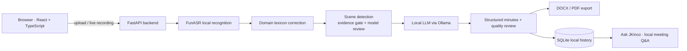

# Architecture

*[中文版 / Chinese version](ARCHITECTURE.md)*

## Overview

## Modules

| Module | Responsibility |
|---|---|
| `frontend/` | React + TypeScript workbench: upload, live recording, human review, export, history, meetings |
| `backend/main.py` | FastAPI routes, authentication, rate limiting, job queue, static assets |
| `backend/meetings.py` | Real-time meeting lifecycle (optional LiveKit), history archival |
| `backend/auth.py` | Local accounts, CAPTCHA, signed sessions, guest quotas |
| `jkinco_asr.py` | FunASR local speech recognition, duration gate, domain correction |
| `jkinco_llm.py` | OpenAI-compatible calls, primary/fallback model degradation, retries |
| `jkinco_classifier.py` | Scene detection: rule-based evidence gate plus model review |
| `jkinco_reports.py` | Chunked extraction, minutes synthesis, quality review, meeting overview |
| `jkinco_export.py` | DOCX / PDF export with original layout |
| `jkinco_history.py` | History storage, visibility rules, search |
| `jkinco_assistant.py` | Local Q&A over the current meeting plus history retrieval |
| `jkinco_dingtalk.py` | Optional DingTalk bot delivery with request signing |

## Data flow

1. The user uploads a recording, or records live in the browser.
2. ffmpeg probes the duration; oversized inputs are rejected before decoding.
3. FunASR transcribes locally, batching at 300-second intervals.
4. The domain lexicon corrects industry terms, personal names, and organization names.
5. The rule-based evidence gate classifies the scene first. The model only reviews that
   decision — **it cannot override strong evidence.**
6. The local LLM generates structured minutes, followed by a second pass checking facts,
   template conformance, and whether every action item has an owner.
7. Results land in local SQLite, ready for human review, export, and Q&A.

## Why the evidence gate comes first

Scene detection decides which document template a meeting gets, and the wrong template
changes what the minutes assert about who is accountable. A language model asked "is this a
construction site review?" will say yes for any meeting that mentions projects, schedules,
and quality — words that appear in almost every business meeting.

So the rules run first and they win. The model can downgrade a classification when evidence
is thin, but it cannot promote one. This is a deliberate asymmetry: a meeting wrongly filed
as "general minutes" is a formatting annoyance, while a meeting wrongly filed as a
construction review is a document that misstates legal responsibility.

## Security perimeter

- All inference happens in-process or against a local Ollama instance. Audio and text never
  leave the machine.
- No cloud credentials exist anywhere. CI rejects cloud-model traces and secrets.
- Login rate limiting, CAPTCHA, HMAC-signed sessions, CSP and security headers.
- Template uploads are hardened against zip bombs, path traversal, and XML entity attacks.
- Job slots are quota-limited separately for accounts and guests.

## Testing

`tests-v2/` contains 895 tests covering the API, security, concurrency, templates, export,
scene rules, and module contracts. `scripts/smoke_test.py` provides an offline smoke entry
point that exercises scene routing and every export path without needing a model.
