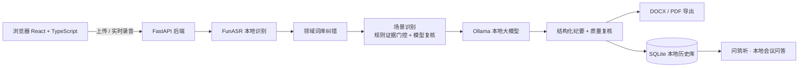

# 架构

## 总览

## 模块职责

| 模块 | 职责 |
|---|---|
| `frontend/` | React + TypeScript 工作台：录音上传、实时录音、校核、导出、历史、会议 |
| `backend/main.py` | FastAPI 路由、认证、限流、任务队列、静态资源 |
| `backend/meetings.py` | 实时会议生命周期（可选 LiveKit）、历史归档 |
| `backend/auth.py` | 本地账号、验证码、会话签名、访客配额 |
| `jkinco_asr.py` | FunASR 本地语音识别，时长闸门，领域纠错 |
| `jkinco_llm.py` | OpenAI 兼容调用，主/备模型降级，重试 |
| `jkinco_classifier.py` | 规则证据门控 + 模型复核的场景识别 |
| `jkinco_reports.py` | 分块提取、纪要合成、质量复核、会议概览 |
| `jkinco_export.py` | DOCX / PDF 原版式导出 |
| `jkinco_history.py` | 历史库读写、可见性、检索 |
| `jkinco_assistant.py` | 基于当前会议 + 历史检索的本地问答 |
| `jkinco_dingtalk.py` | 可选钉钉机器人推送（加签） |

## 数据流

1. 用户上传录音或浏览器实时录音；
2. ffmpeg 探测时长，超限拦截；
3. FunASR 本地转写，按 300 秒批处理；
4. 领域词库纠错（工程术语、人名、单位）；
5. 规则证据门控先判场景，模型只做复核，不能推翻强证据；
6. 本地大模型生成结构化纪要，再做一轮事实/模板/责任闭环质检；
7. 结果落本地 SQLite，支持校核、导出、问答。

## 安全边界

- 所有推理在进程内或本机 Ollama 完成，音频与文本不出本机；
- 无任何云端凭据；CI 红线扫描拒绝云端模型痕迹与密钥；
- 登录限流、验证码、会话 HMAC 签名、CSP/安全头；
- 模板上传防 Zip 炸弹、路径穿越、XML 实体攻击；
- 任务槽位按账号与访客分别配额。

## 测试

`tests-v2/` 共 894 个测试，覆盖 API、安全、并发、模板、导出、场景规则与模块契约。
`scripts/smoke_test.py` 提供离线冒烟入口。
