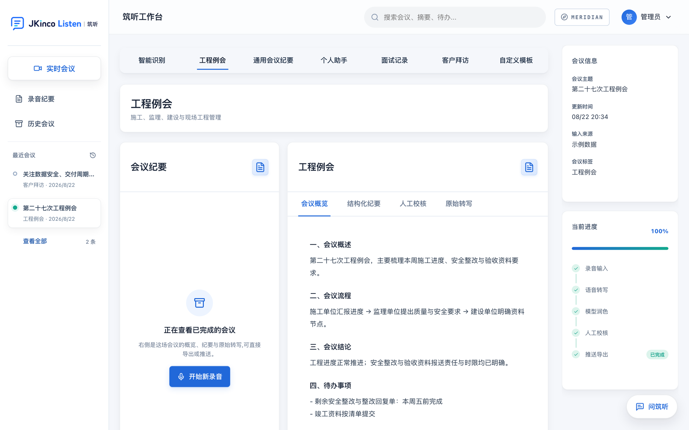

# JKinco Listen · 筑听（开源本地版）

本地优先的 AI 会议纪要工作台：**录音转写 → 场景识别 → 结构化纪要 → DOCX/PDF 导出**，
全流程 100% 本地运行，数据不出本机。

*Local-first AI meeting minutes workbench. Recording → transcript → structured minutes →
DOCX/PDF, entirely on your own machine. No API keys, no cloud calls.*
[English README](https://github.com/wenxuanzhang1209-cyber/jkinco-listen-open/blob/main/README.en.md)

<video src="demo.mp4" controls muted loop playsinline width="100%" poster="demo-minutes.png"
       style="border-radius:12px;box-shadow:0 8px 28px rgba(15,23,42,.18);margin:20px 0">
  你的浏览器不支持内嵌视频，<a href="demo.mp4">点这里下载演示</a>。
</video>

- 🎙 本地语音识别：FunASR `paraformer-zh`
- 🧠 本地大模型：Ollama（默认 `qwen2.5:7b-instruct`）
- 🏗 规则证据门控的场景识别：工程例会 / 通用 / 个人 / 面试 / 客户拜访
- 📄 原版式 DOCX/PDF 导出
- 🔒 零 API Key、零云端、零遥测
- 🐳 Docker 一条命令部署

## 产出物长这样

会议概述、流程、结论、待办事项——直接可归档，右侧是从录音到导出的完整流水线。



## 快速开始

```bash
git clone https://github.com/wenxuanzhang1209-cyber/jkinco-listen-open.git
cd jkinco-listen-open
cp .env.example .env
docker compose up -d --build
```

访问 <http://localhost:8080>。

> ⚠️ **接到网络上之前先改口令。** `.env.example` 里预置了 `JKINCO_AUTH=admin:123456`，
> 是为了让本地试用能立刻跑起来。容器监听的是 `0.0.0.0`——只要能访问到端口的人，都能用
> 这组默认口令登录。除 localhost 之外的任何绑定，请先改掉 `.env` 里的 `JKINCO_AUTH`。

想先体验界面、不下载模型？设置 `JKINCO_DEMO_DATA=1` 即可获得两条示例纪要，
导出、历史检索、模板都能直接玩。

## 和别的方案比

|  | 筑听开源版 | 云端会议助手 | 直接用 Whisper |
|---|---|---|---|
| 音频是否出本机 | **从不** | 是 | 从不 |
| 需要 API Key | **不需要** | 需要 | 不需要 |
| 产出物 | **排好版的 DOCX/PDF** | 转写 + 摘要 | 纯转写 |
| 会议类型区分 | **五类，证据门控** | 单一格式 | 无 |

只要转写的话，直接用 Whisper 更简单。这个项目要解决的是**转写之后**那一段：
把它变成一份能归档、能发出去的文档。

## 文档

- [项目主页（README）](https://github.com/wenxuanzhang1209-cyber/jkinco-listen-open)
- [架构](ARCHITECTURE.md)
- [模型指南](LOCAL_MODELS.md)
- [路线图](ROADMAP.md)
- [开源版说明](OPEN_EDITION.md)

## 社区

- [Discussions](https://github.com/wenxuanzhang1209-cyber/jkinco-listen-open/discussions)
- [Issue](https://github.com/wenxuanzhang1209-cyber/jkinco-listen-open/issues)

如果它帮你省下了手动整理纪要的时间，请去仓库点个 ⭐ Star。

MIT License © 2026 JKinco
